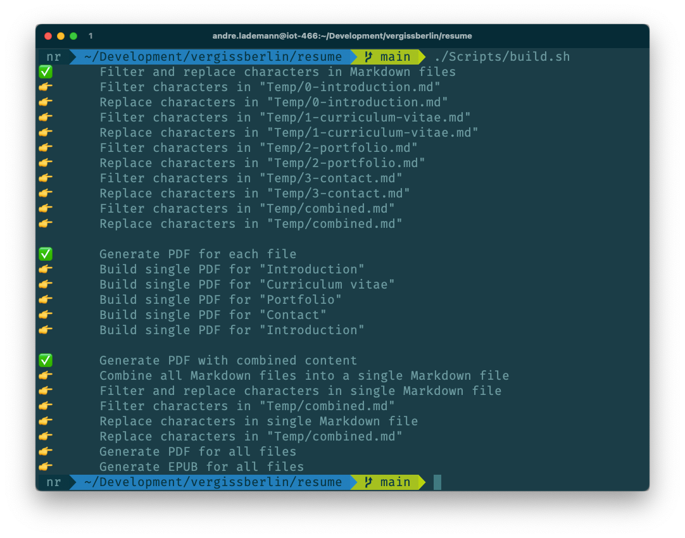

# Pandoc with GitHub actions example

 
 

> This repository is a template to create your professional resume as PDF and EPUB with Pandoc, the Eisvogel template and a GitHub Actions.

## Documents

| View                                                 | Download                                                                   |
|------------------------------------------------------|----------------------------------------------------------------------------|
| [📄 Introduction](Content/0-introduction.md)         | [📄 PDF](https://github.com/vergissberlin/resume-template/releases/latest) |
| [📄 Curriculum Vitae](Content/1-curriculum-vitae.md) | [📄 PDF](https://github.com/vergissberlin/resume-template/releases/latest) |
| [📄 Profile](Content/2-portfolio.md)                 | [📄 PDF](https://github.com/vergissberlin/resume-template/releases/latest) |
| [📄 Contact](Content/3-contact.md)                   | [📄 PDF](https://github.com/vergissberlin/resume-template/releases/latest) |

---

## Usage

There are to different types how to use this generator with different requirements.

**But first do following steps:**
1. Create a new repository from this template
2. Make your changes in the `Content` folder

**Now you have two options:**
1. Use the GitHub Actions to generate your resume automatically
   1. Push your changes to GitHub `git push`
   2. Set a tag to trigger the GitHub Actions `git tag 1.0.0` and `git push --tags`
   3. Download the generated files from your releases page
2. Use the Docker image to generate your resume locally
   1. Install [Docker](https://docs.docker.com/get-docker/)
   2. Run ``/Scripts/build.sh`` to generate the resume as PDF and EPUB
   3. The generated files are in the `Results` folder

**The Process should look like this:**

---

## License

This software is licensed under  the [Creative Commons Attribution-NonCommercial-ShareAlike 4.0 International License](https://creativecommons.org/licenses/by-nc-sa/4.0/).

**You are free to:**
- Share — copy and redistribute the material in any medium or format
- Adapt — remix, transform, and build upon the material
- The licensor cannot revoke these freedoms as long as you follow the license terms.

**Under the following terms:**
- Attribution — You must give appropriate credit, provide a link to the license, and indicate if changes were made.
  You may do so in any reasonable manner, but not in any way that suggests the licensor endorses you or your use.
- NonCommercial — You may not use the material for commercial purposes.
- ShareAlike — If you remix, transform, or build upon the material, you must distribute your contributions under the
  same license as the original.
- No additional restrictions — You may not apply legal terms or technological measures that legally restrict others
  from doing anything the license permits.

**Notices:**
- You do not have to comply with the license for elements of the material in the public domain or where your use is
  permitted by an applicable exception or limitation.
- No warranties are given. The license may not give you all of the permissions necessary for your intended use. For
  example, other rights such as publicity, privacy, or moral rights may limit how you use the material.
